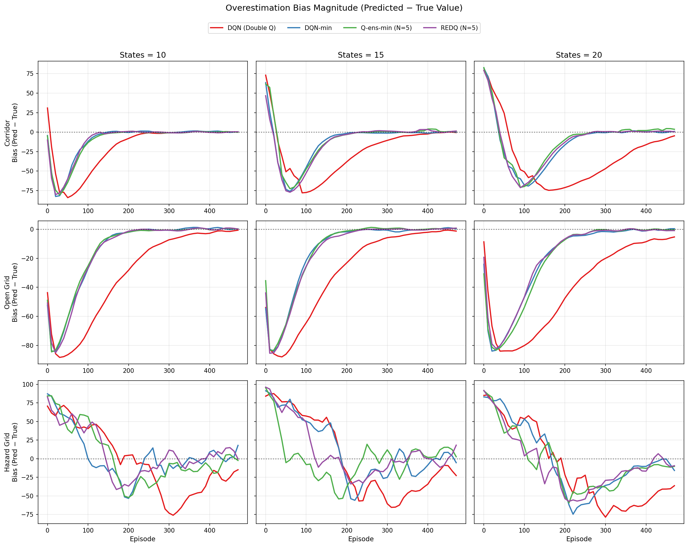
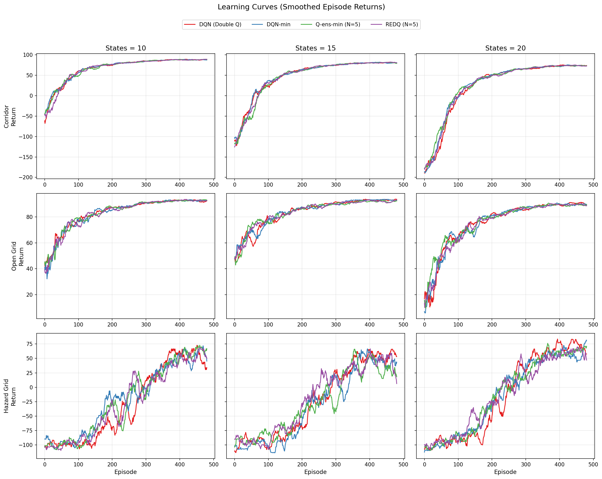
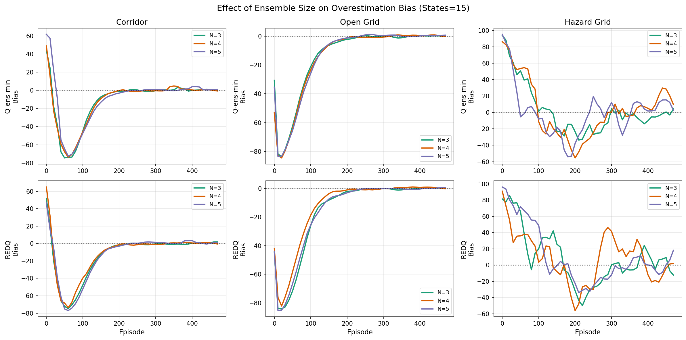
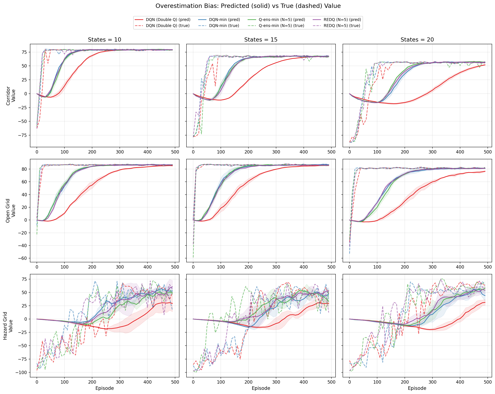
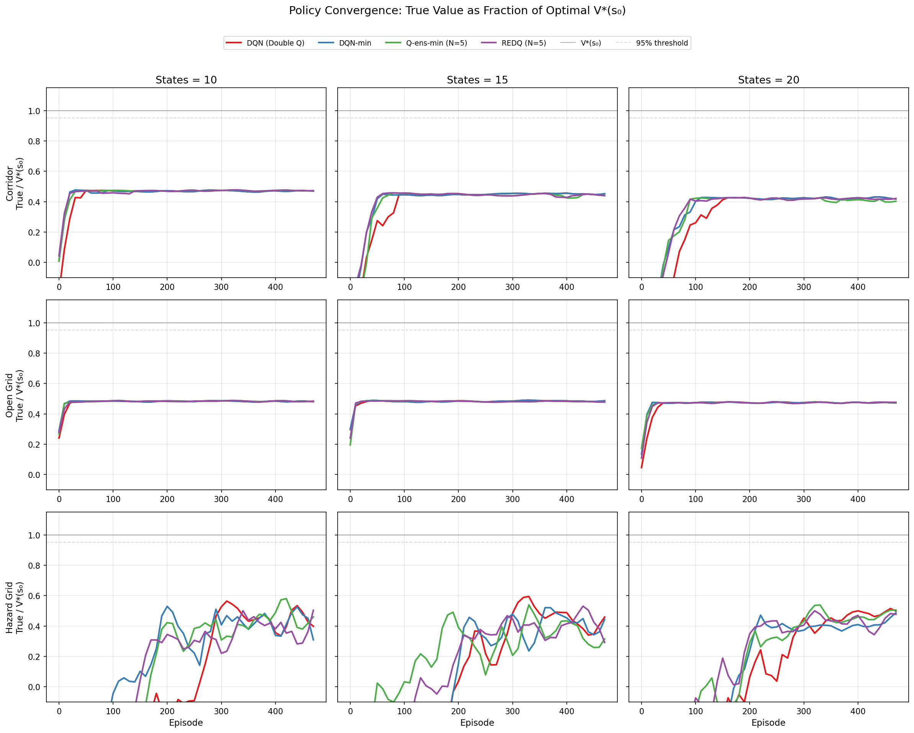

# DM887 — Assignment 2: Profiling Overestimation Bias in Ensemble Q-Learning

This repository contains my solution for **DM 887 Reinforcement Learning (Spring 2026) - Assignment #2**.

The goal of the assignment is to **profile overestimation bias** in tabular Q-learning variants by monitoring the evolution of:
- **Predicted returns** (value estimates from the learned Q-tables), and
- **Observed returns** (empirical discounted returns under the current greedy policy),

across training episodes, and to compare how the bias changes with **algorithm choice**, **ensemble size**, and **environment state size**.

---

## Contents

- [assignment2.ipynb](assignment2.ipynb) (or similarly named notebook)  
  End-to-end workflow:
  - Environment definitions
  - Algorithm implementations
  - Experiment runner
  - Plot generation

- `assignment2_rapport.tex`  
  LaTeX source for the report.

- [assignment2_rapport.pdf](assignment2_rapport.pdf)  
  Final report (compiled from the LaTeX source).

- Generated figures (PNG):
  - [](overestimation_magnitude.png)
  - [](learning_curves.png)
  - [](ensemble_size_effect.png)
  - [](overestimation_bias.png)
  - [](policy_convergence.png)

---

## Implemented Algorithms (Tabular)

The following methods are implemented and compared:

- **Double Q-learning (Double Q)**  
  Decouples action selection and evaluation using two Q-tables.

- **DQN-min (clipped double Q target)**  
  Uses min-clipping over two critics in the Bellman target (TD3-style clipped target idea, adapted to tabular Q).

- **Q-ensemble-min (full ensemble min)**  
  Maintains an ensemble of Q-tables and uses min-clipping across **all** ensemble members in the target.

- **REDQ-style target (random pair min)**  
  Maintains an ensemble and applies min-clipping on a randomly sampled pair (subset) for the target.

> Note: While the names originate from deep RL literature, all implementations here are **tabular**.

---

## Environments

Three episodic tabular environments were designed to highlight overestimation effects under stochasticity and sharp value contrasts:

1. **Stochastic Corridor**  
   Narrow path to a goal state; stochastic transitions (“slip”) and optional reward noise.

2. **Open Grid**  
   Many paths to the goal; stochasticity increases the impact of the max operator.

3. **Hazard Grid**  
   Open grid with terminal holes (large negative reward) to create risky regions and sharp value differences.

**State size** is a tunable parameter (e.g., starting at 10 and increasing by increments of 5).

---

## Experimental Protocol (High-level)

For each (environment × state size × algorithm × ensemble size) configuration:

- Train for a fixed number of episodes using ε-greedy exploration with linear decay.
- At regular evaluation intervals:
  - Compute **predicted value** from the current Q-estimates (from the start state).
  - Compute **observed value** by running multiple rollouts with the current greedy policy.
  - Track **overestimation bias** as the difference between predicted and observed values.
- Repeat across multiple random seeds and report averaged curves.

---

## How to Run

### 1) Create an environment

Recommended: create a clean Python environment (conda/venv).

```bash
python -m venv .venv
source .venv/bin/activate   # macOS/Linux
# .venv\Scripts\activate    # Windows
pip install -U pip
```

---

### 2) Install dependencies

The notebook installs dependencies directly (including local packages). The relevant commands used were:

```bash
pip install numpy matplotlib pygame gym
pip install --no-deps ./GridWorld ./objectrl
```

---

### 3) Run the notebook

Open and run all cells:

```bash
jupyter notebook
```

The notebook will:
- run experiments,
- produce plots,
- save `.png` figures to disk.

---

## Reproducibility Notes

- Random seeds are fixed where relevant.
- Results are averaged over multiple seeds.
- Evaluation uses multiple greedy rollouts to estimate observed returns.

Because the environments include stochastic transitions and optional reward noise, results may vary slightly across machines and dependency versions.

---

## AI Usage (Disclaimer)

Claude Opus 4.6 was used to support the development of:
1) the experimental design,  
2) the algorithm implementation,  
using GridWorld and ObjectRL.

Notion AI was used to support drafting and editing the report text in LaTeX.

---

## License / Academic Integrity

This repository is intended for course submission and academic evaluation. Please do not copy without permission and attribution.