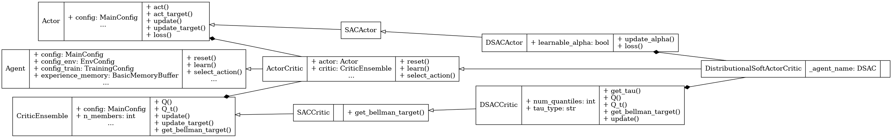

Distributional Soft Actor Critic (DSAC)
=======================================

.. raw:: html

   distributional rl
   quantile regression

**Paper**: `DSAC: Distributional Soft Actor-Critic for Risk-Sensitive Reinforcement Learning <https://www.jair.org/index.php/jair/article/view/17526/27184>`_

Pseudocode
----------

.. pdf-include:: ../../_static/pseudocodes/dsac.pdf
    :width: 100%

Configuration
----------------

.. literalinclude:: ../../../objectrl/config/model_configs/dsac.py
    :language: python
    :start-after: [start-config]
    :end-before: [end-config]
    :caption: Specific configuration for the DSAC algorithm (in config/model_configs/).

UML Diagram
----------------

    UML diagram for the DSAC algorithm.

.. raw:: html

   
We use the UML diagram to illustrate the relationships between the classes in our DSAC implementation.

   
The diagram shows how the <code>DSACActor</code> and <code>DSACCritic</code> classes inherit from <code>SACActor</code> and <code>SACCritic</code>, respectively. <code>DistributionalSoftActorCritic</code> class also inherits from <code>ActorCritic</code> class which inherits from <code>Agent</code>.

   
We illustrate each class's crucial attributes and methods for DSAC. Specifically: 

   
<code>DSACActor</code> adapts the SAC actor to support both fixed and learnable entropy temperature <code>alpha</code>. 
   
When <code>learnable_alpha=False</code>, the temperature is frozen, and no optimizer is maintained. The actor loss is modified to use quantile-weighted Q-values produced by the distributional critic.

   
<code>DSACCritic</code> implements quantile-based value estimation. The <code>get_tau()</code> method generates quantile fractions either uniformly (fixed) or using an IQN-style sampling strategy. The <code>Q()</code> and <code>Q_t()</code> methods evaluate the ensemble over these quantile midpoints using <code>torch.vmap</code>, returning full value distributions.

   
The <code>get_bellman_target()</code> method computes entropy-regularized distributional Bellman targets by applying SAC's clipped minimum across ensemble quantile outputs. The <code>update()</code> method performs quantile regression to align predicted and target quantile distributions.

Classes
-------

.. autoclass:: objectrl.models.dsac.DSACActor
    :undoc-members:
    :show-inheritance:
    :private-members:
    :members:
    :exclude-members: _abc_impl

.. autoclass:: objectrl.models.dsac.DSACCritic
    :undoc-members:
    :show-inheritance:
    :private-members:
    :members:
    :exclude-members: _abc_impl

.. autoclass:: objectrl.models.dsac.DistributionalSoftActorCritic
    :undoc-members:
    :show-inheritance:
    :private-members:
    :members:
    :exclude-members: _abc_impl